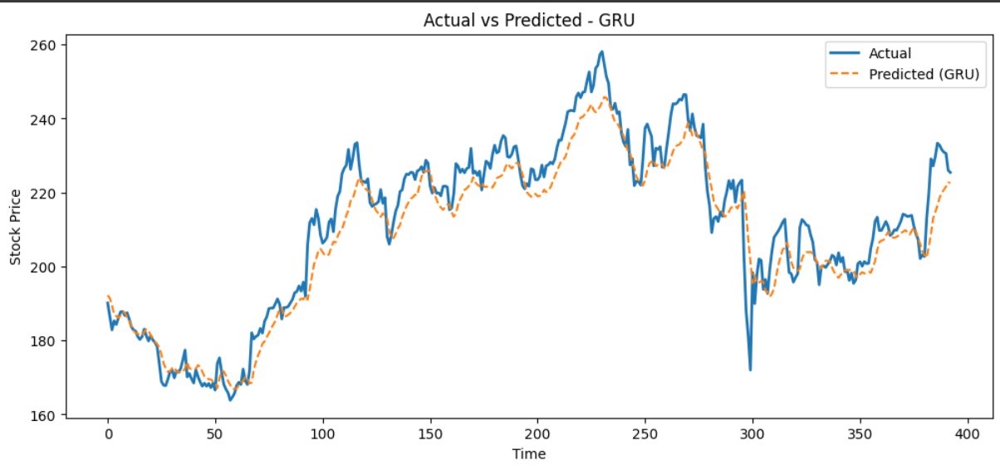
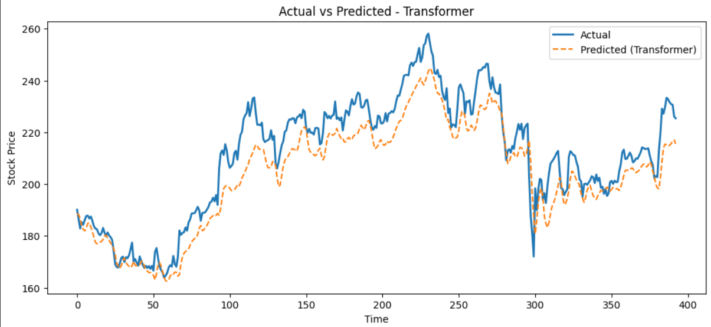
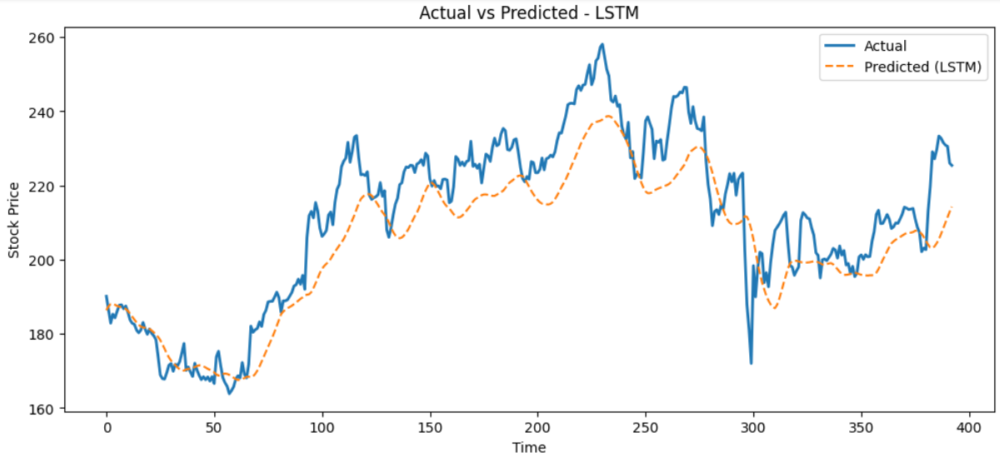

# 📈 Stock Price Prediction with Deep Learning Models

This project explores and compares multiple deep learning architectures for **time series forecasting** of stock prices.  
The models implemented include **MLP, LSTM, GRU, CNN, and Transformer**.  

Our goal is to evaluate which architecture provides the most accurate predictions based on key performance metrics.

---

## 🚀 Models Implemented

### 1. **Multilayer Perceptron (MLP)**
- **Input**: Flattened historical window of stock prices  
- **Architecture**:
  - Dense → Dense → Output Layer  
- **Strengths**: Simple, fast to train  
- **Limitations**: Ignores temporal dependencies  

---

### 2. **Long Short-Term Memory (LSTM)**
- **Input**: Sequential stock price data (timesteps × features)  
- **Architecture**:
  - LSTM Layer(s) → Dense Layer → Output Layer  
- **Strengths**: Captures long-term temporal dependencies  
- **Limitations**: Training can be slow  

---

### 3. **Gated Recurrent Unit (GRU)**
- **Input**: Sequential stock price data  
- **Architecture**:
  - GRU Layer(s) → Dense Layer → Output Layer  
- **Strengths**: Faster and simpler than LSTM while preserving temporal memory  
- **Performance**: ⭐ **Best performer in this project**  

---

### 4. **Convolutional Neural Network (CNN)**
- **Input**: Sliding window of stock prices  
- **Architecture**:
  - 1D Convolution Layer(s) → Flatten → Dense → Output Layer  
- **Strengths**: Good at local pattern detection  
- **Limitations**: Fails to capture long-term trends  

---

### 5. **Transformer**
- **Input**: Sequential stock price data  
- **Architecture**:
  - Self-Attention Encoder → Dense Layer → Output Layer  
- **Strengths**: Captures global dependencies, scalable  
- **Limitations**: Requires more data and compute  

---

## 📊 Results

| Model        | MSE       | MAE      | MAPE (%) | R² Score |
|--------------|-----------|----------|-----------|----------|
| **GRU**      | **46.27** | **5.18** | **2.41**  | **0.911** |
| Transformer  | 90.21     | 7.96     | 3.68      | 0.826    |
| LSTM         | 121.38    | 8.72     | 4.00      | 0.765    |
| CNN          | 329.60    | 15.66    | 7.21      | 0.363    |
| MLP          | 362.91    | 15.44    | 7.20      | 0.298    |

✅ **GRU achieved the best overall performance** with the lowest error and highest R² score.  
⚠️ MLP and CNN performed poorly compared to recurrent and attention-based models.

---

## 📉 Visualizations

Here are the plots comparing **predictions vs actual stock prices** for the **Top 3 models (GRU, LSTM, Transformer):**

- 📌 **GRU Predictions**
  

- 📌 **Transformer Predictions**
  

- 📌 **LSTM Predictions**
  

---

## ⚙️ Tech Stack
- **Python 3.10+**
- **TensorFlow / Keras**
- **Pandas, NumPy**
- **Matplotlib, Seaborn**

---

## 🏆 Key Takeaways
- GRU is the most **efficient and accurate** model for this dataset.  
- LSTM performs well but at a higher training cost.  
- Transformers show promise but require larger datasets.  
- CNN and MLP are **not ideal** for sequential forecasting.

---
